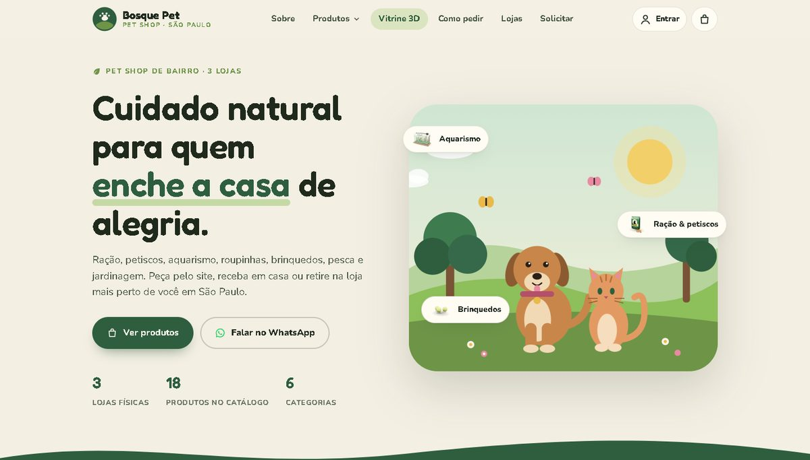
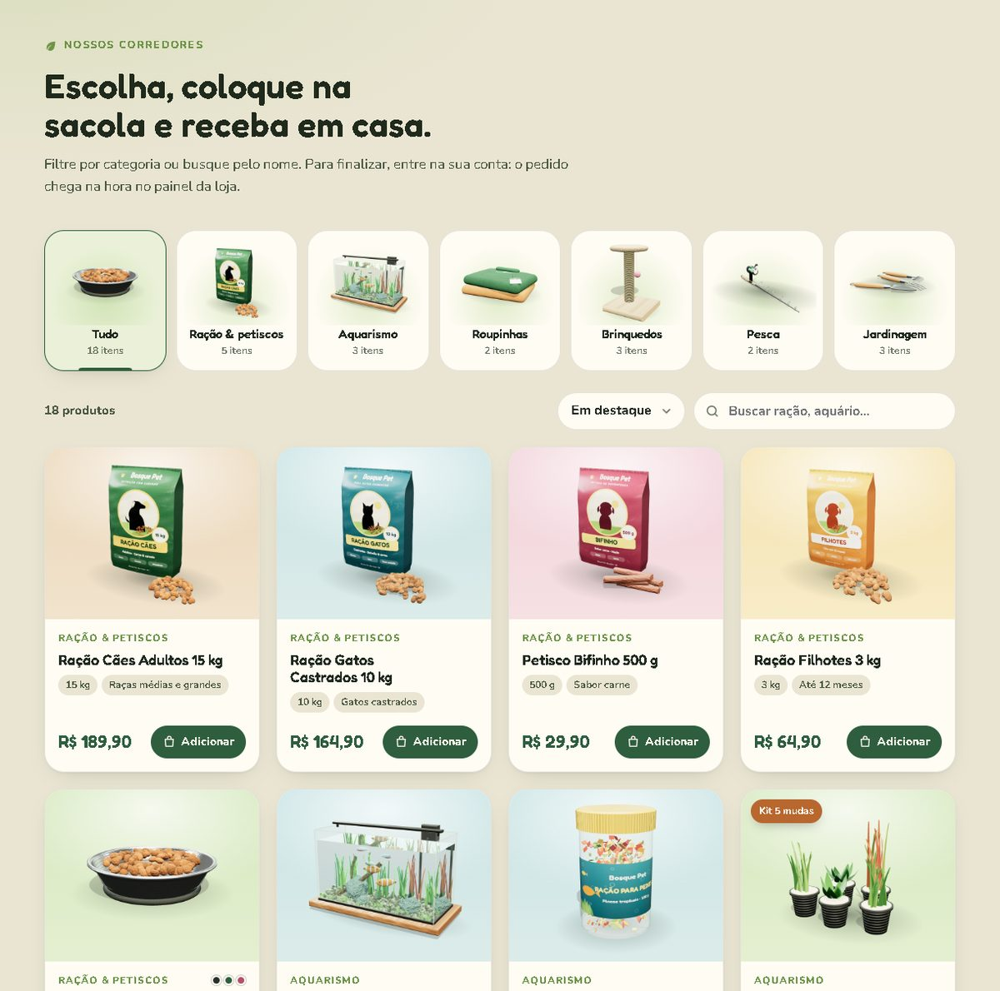
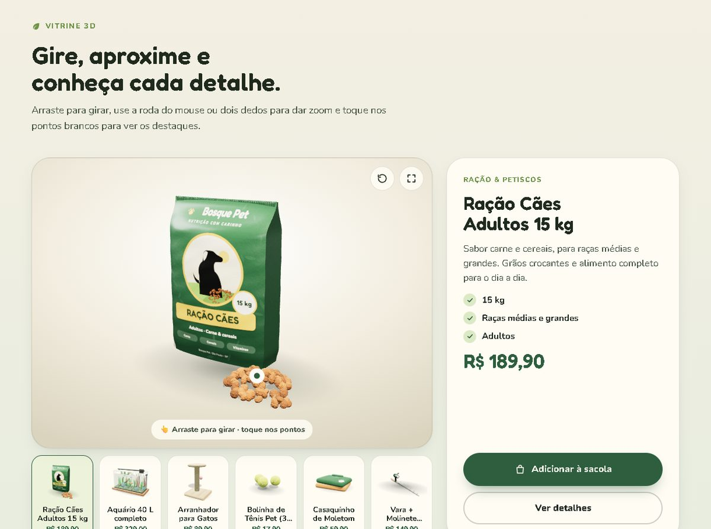
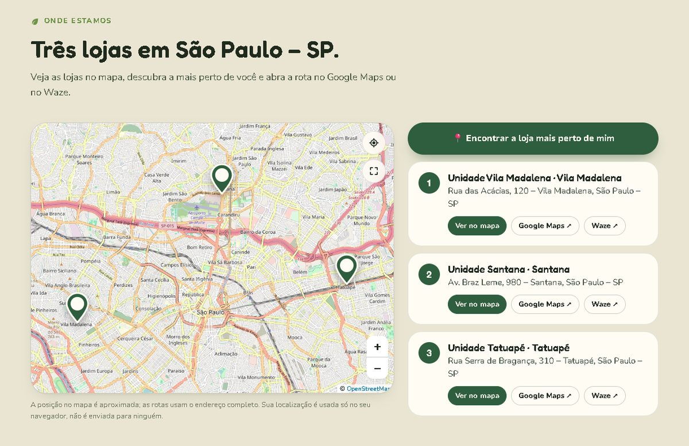
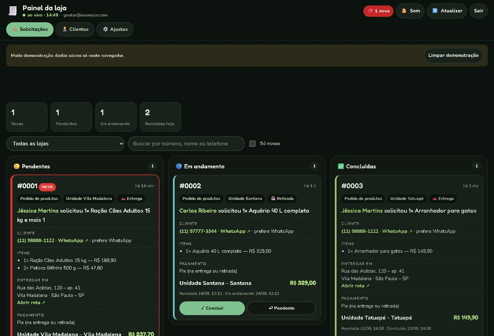
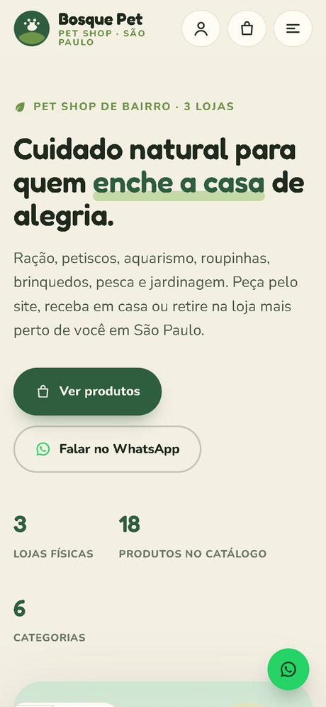

# Bosque Pet — site de pet shop com painel de pedidos

Projeto completo de um site para pet shop de bairro: catálogo com vitrine 3D, conta
do cliente, pedido pelo celular e um painel onde a equipe da loja acompanha cada
pedido em tempo real.

**Loja fictícia.** Nome, endereços, contatos e dados são de demonstração, criados
para este projeto de portfólio.



---

## Ver funcionando

O site roda **sem back-end**: enquanto não houver um banco configurado, tudo
funciona no navegador de quem está visitando (modo demonstração).

| O que ver | Como |
|---|---|
| Site do cliente | abra `index.html` |
| Fazer um pedido | crie uma conta em **Minha conta** e envie uma solicitação |
| Painel da loja | abra `painel.html?demo=1` e ele entra sozinho |
| Painel, entrada manual | código da equipe **1234**, ou aba **Sou o gestor** com qualquer e-mail e senha |

O painel já abre com pedidos de exemplo, para dar para ver o fluxo sem cadastrar nada.

```bash
git clone https://github.com/PitsayCode/Site_Petshop.git
cd Site_Petshop
python -m http.server 5500
# abra http://localhost:5500
```

---

## O que o projeto faz

### Para o cliente

- **Catálogo** com 18 produtos, busca, filtro por categoria e sacola de compras
- **Vitrine 3D**: o produto gira, aproxima e mostra detalhes, feito em Three.js
- **Mapa das unidades** com botão "loja mais perto de mim" e rota no Google Maps ou Waze
- **Conta própria**: cadastro, login, recuperação de senha e endereço salvo
- **Pedido com número, data e hora**, e acompanhamento do status em "Novas" e "Antigas"





### Para a loja

- **Quadro de pedidos** em três colunas: pendente, em andamento e concluído
- **Destaque e aviso sonoro** para pedido novo, com atualização automática
- **Dados de entrega** com rota pronta e contato do cliente em um toque
- **Dois acessos**: o gestor entra com e-mail e senha; a equipe, com um código que o
  gestor troca quando quiser
- **Lista de clientes** com busca



### No celular

Todas as telas foram feitas para o celular primeiro, que é onde o cliente de um
pet shop de bairro está.



---

## Como foi construído

**Sem framework, sem build.** HTML, CSS e JavaScript puros: o site abre direto, e a
loja pode hospedar em qualquer lugar, inclusive nos planos mais simples.

| Camada | Escolha |
|---|---|
| Interface | HTML, CSS (variáveis, tema claro e escuro) e JavaScript sem dependências |
| 3D | Three.js r147, com modelos e texturas gerados por código, sem arquivos pesados |
| Mapa | Leaflet e OpenStreetMap, com troca automática de provedor se um falhar |
| Dados | Supabase (PostgreSQL, autenticação, RLS e tempo real) |
| Sem banco | Modo demonstração equivalente, usando o armazenamento do navegador |

### Decisões que valem comentar

- **Duas implementações, uma interface.** `js/api.js` expõe um único `PetAPI`. Por
  trás dele há o motor do Supabase e o motor de demonstração, com a mesma assinatura.
  As telas não sabem qual está em uso, então o site roda com ou sem back-end.
- **Segurança no banco, não na tela.** As regras de acesso vivem no PostgreSQL
  (RLS e funções `security definer`, em `supabase/schema.sql`): cada cliente só lê os
  próprios pedidos, e o painel exige gestor autenticado ou o código da equipe. Esconder
  botão não é controle de acesso.
- **Vitrine 3D que não pesa.** Os modelos são construídos em código com formas
  simples e texturas desenhadas em canvas, com materiais físicos e sombras. Não há
  arquivos `.glb` para baixar.
- **Mapa à prova de bloqueio.** Alguns provedores de tiles bloqueiam sites sem
  cadastro e respondem com uma imagem de erro. O site testa a resposta antes de usar
  e troca de provedor quando necessário.
- **Feito para quem vai usar.** Mensagens de erro em português claro, painel que
  funciona no celular do balcão e nenhum jargão técnico na tela.

---

## Estrutura

```
├── index.html          Página principal (catálogo, vitrine 3D, mapa, sacola)
├── solicitacao.html    Formulário de pedido
├── login.html          Entrar, criar conta, recuperar senha, meus pedidos
├── painel.html         Painel da loja
├── .htaccess           Config. de hospedagem (endereços sem .html, segurança, cache)
├── vercel.json         Mesma config. para Vercel/Netlify
├── supabase/schema.sql Banco de dados, regras de acesso e tempo real
├── css/styles.css
├── docs/               Imagens deste README
└── js/
    ├── config.js       Contatos, unidades e chaves do banco
    ├── api.js          Camada de dados (Supabase ou demonstração)
    ├── crypto.js       Hash de senha do modo demonstração
    ├── solicitacao.js  Formulário de pedido
    ├── login.js        Conta do cliente
    ├── painel.js       Painel da loja
    ├── main.js         Página principal
    ├── mapa.js         Mapa das unidades
    ├── produto3d.js    Vitrine 3D e visualização rápida
    ├── data.js         Catálogo
    └── 3d/             Motor e modelos 3D
```

---

## Ligar a um banco de verdade

1. Crie um projeto no [Supabase](https://supabase.com) (plano gratuito serve).
2. No **SQL Editor**, rode `supabase/schema.sql`.
3. Em `js/config.js`, preencha:

   ```js
   supabaseUrl: "https://SEU-PROJETO.supabase.co",
   supabaseKey: "sb_publishable_...",   // chave publicável; a secreta nunca entra no site
   ```

4. Em **Authentication → URL Configuration**, informe o endereço do site.
5. Para o "esqueci minha senha" chegar de verdade, configure um SMTP próprio em
   **Authentication → SMTP Settings**. O envio padrão do Supabase é limitado.

Com os campos preenchidos, o mesmo código passa a gravar no banco, com contas reais,
regras de acesso e atualização em tempo real no painel.

---

## Autor

**Victor Alexandre da Silva** — desenvolvimento de sites e soluções digitais.
